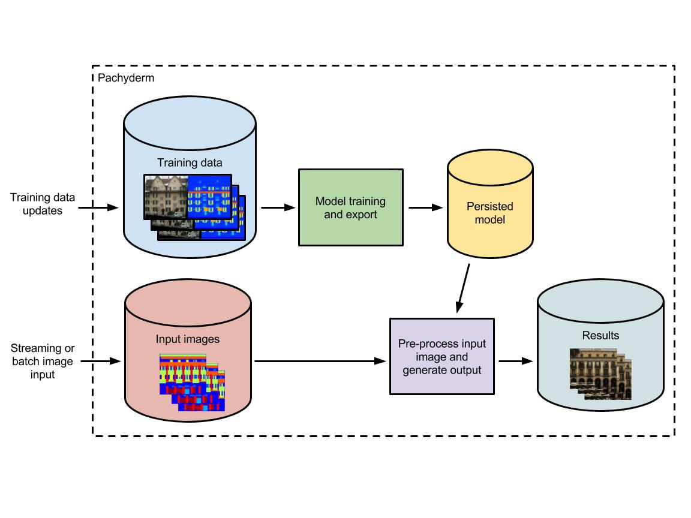
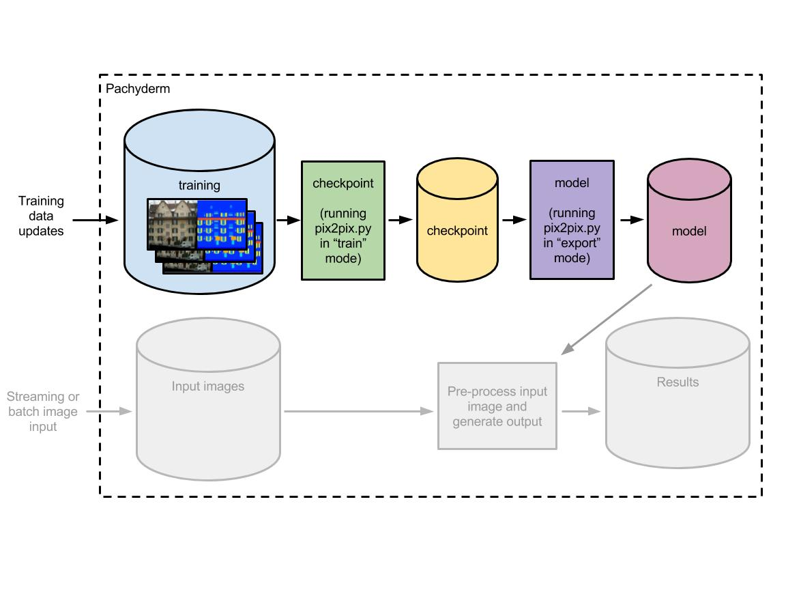
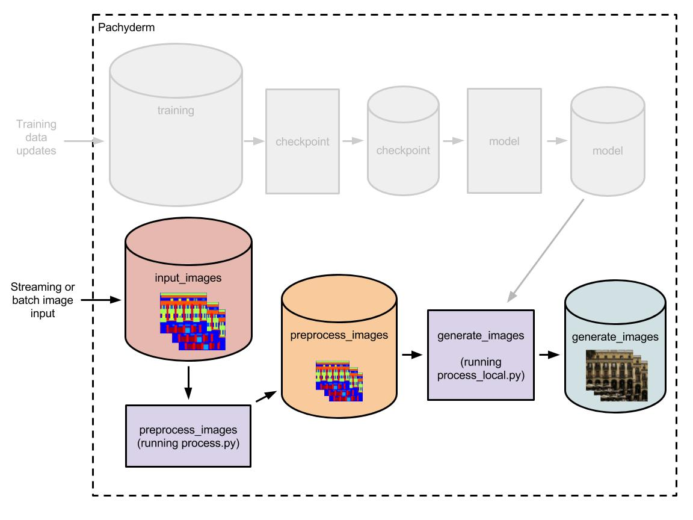

# pix2pix with TensorFlow

Christopher Hesse’s image-to-image demos use a Tensorflow implementation of the Generative Adversarial Networks (or GANs) model presented in this [article](https://arxiv.org/pdf/1611.07004v1.pdf).  Chris’s full Tensorflow implementation of this model can be found [on Github](https://github.com/affinelayer/pix2pix-tensorflow) and includes documentation about how to perform training, testing, pre-processing of images, exporting of the models for serving, and more.  

In this example we will utilize Chris’s code in that repo along with a Docker image based on an image he created to run the scripts (which you can also utilize in your experiments with pix2pix).

## The pipeline

To deploy and manage the model discussed above, we will implement it’s training, export, preprocessing, and image generation in a reusable Pachyderm pipeline.  This will allow us to:

- Keep a rigorous historical record of exactly what models were used on what data to produce which results.
- Automatically update online ML models when training data or parameterization changes.
- Easily revert to other versions of an ML model when a new model is not performing or when “bad data” is introduced into a training data set.

The general structure of our pipeline will look like this:

The cylinders represent data “repositories” in which Pachyderm will version training, model, etc. data (think “git for data”).  These data repositories are then input/output of the linked data processing stages (represented by the boxes in the figure).  

## Getting up and running with Pachyderm

You can experiment with this pipeline locally using a quick [local installation of Pachyderm](http://docs.pachyderm.io/en/latest/getting_started/local_installation.html).  Alternatively, you can quickly spin up a real Pachyderm cluster in any one of the popular cloud providers.  Check out the [Pachyderm docs](http://docs.pachyderm.io/en/latest/deployment/deploy_intro.html) for more details on deployment.

Once deployed, you will be able to use the Pachyderm’s `pachctl` CLI tool to create data repositories and start our deep learning pipeline.

## Preparing the training and model export stages

First, let’s prepare our training and model export stages. Chris Hesse’s `pix2pix.py` script includes:

- A “train” mode that we will use to train our model on a set of paired images (such as facades paired with labels or edges paired with cats). This training will output a “checkpoint” representing a persisted state of the trained model.
- An “export” mode that will then allow us to create an exported version of the checkpointed model to use in our image generation.

Thus, our “Model training and export” stage can be split into a training stage (called “checkpoint”) producing a model checkpoint and an export stage (called “model”) producing a persisted model used for image generation:

We can deploy this part of the pipeline in two quick steps:

1. Create the initial “training” data repository with `pachctl create-repo training`.
2. Supply Pachyderm with a JSON specification, `training_and_export.json`, telling Pachyderm to: (i) run Chris’s `pix2pix.py` script in “train” mode on the data in the “training” repository outputting a checkpoint to the “checkpoint” repository, and (ii) run the `pix2pix.py` script in “export” mode on the data in the “checkpoint” repository outputting a persisted model to the “model” repository. This can be done by running `pachctl create-pipeline -f training_and_export.json`.

(training could take 15+ minutes depending on how many images are supplied in the training set and the exact setting of the `pix2pix.py` script)

## Preparing the pre-processing and image generation stages

Next, let’s prepare our pre-processing and image generation stages. Our trained model will be expecting PNG image data with certain properties (256 x 256 in size, 8-bit/color RGB, non-interlaced).  As such, we need to pre-process (specifically resize) our images as they are coming into our pipeline, and Chris has us covered with a `process.py` script to perform the resizing.

To actually perform our image-to-image translation, we need to use a `process_local.py` script.  This script will take our pre-processed images and persisted model as input and output the generated, translated result:

Again, we can deploy this part of the pipeline in two quick steps:

1. Create the initial “input_images” data repository with `pachctl create-repo input_images`. 
2. Supply Pachyderm with another JSON specification, `pre-processing_and_generation.json`, telling Pachyderm to: (i) run the `process.py` script in on the data in the “input_images” repository outputting to the “preprocess_images” repository, and (ii) run the `process_local.py` with the model in the “model” repository and the images in the “preprocess_images” repository as input. This can be done by running `pachctl create-pipeline -f pre-processing_and_generation.json`.

## Putting it all together, generating images
Now that we have created our input data repositories (“input_images” and “training”) and we have told Pachyderm about all of our processing stages, our production-ready deep learning pipeline will run automatically when we put data into “training” and “input_images.”  It’s just works.

Chris has provides a nice guide for preparing training sets [here](https://github.com/affinelayer/pix2pix-tensorflow#datasets-and-trained-models).  You can use cat images, dog images, building, or anything that might interest you.  Be creative and show us what you come up with!  When you have your training and input images ready, you can get them into Pachyderm using the `pachctl` CLI tool or one of the Pachyderm clients.  
